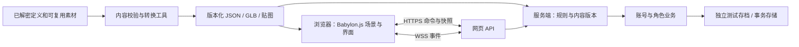

# Nordicandia 网页版复刻计划

研究日期：2026-10-01。用户已确认首版优先「保留 3D 风格和核心玩法」。本文是实施建议。

> **进度（2026-10-02）**：
> - M0 可行性验证完成：原作没有骨骼角色/怪物模型，战斗角色/怪物是 2D 头像 token，环境是 3D 网格；网页采用「3D 环境 + 头像 token」。
> - M1 服务端权威战斗切片完成：固定步长模拟、命令幂等、经验落盘并在刷新后恢复，浏览器只发送意图并渲染状态。
> - M2 装备与成长循环完成：掉落/背包/穿戴、Boss 与地下城循环、奖励不重复；装备实时改变战斗数值。
>
> 详见 [`docs/web/M0_STATUS.md`](web/M0_STATUS.md)、[`M0_ASSET_AUDIT.md`](web/M0_ASSET_AUDIT.md)、[`M0_RULES.md`](web/M0_RULES.md)、[`M1_STATUS.md`](web/M1_STATUS.md)、[`M2_STATUS.md`](web/M2_STATUS.md)。

## 1. 推荐路线

采用 **TypeScript + Babylon.js 的浏览器 3D 客户端，复用现有 .NET 后端与已解密的数据定义**。保持原版俯视角、自动战斗、刷装备、技能搭配和角色成长的体验；先完成一个小范围可玩版本，再逐步提高画面与机制还原度。

当前仓库的优势是数据、协议和存档逻辑；主要缺口是可编辑的客户端工程、可直接用于网页的模型动画，以及完整的战斗规则实现。APK/Steam 的 IL2CPP 二进制不能直接转换为可维护的浏览器游戏，类型转储也不等于恢复了 C# 方法实现。

| 路线 | 对当前项目的适用性 | 决策 |
|---|---|---|
| 原 Unity 工程导出 Web | 若有完整工程、脚本和资源引用，可能保留最多原有表现；仍需改网络与平台依赖 | 当前未发现完整工程，保留为条件性备选 |
| 重建 Unity 工程后导出 Web | 需要恢复资源、场景和大量逻辑，再解决网页平台适配 | 暂不优先；先评估恢复成本 |
| Babylon.js + TypeScript 重写 | 可以直接设计浏览器操作、加载和网络，复用数据及服务端业务 | **推荐** |
| Three.js 重写 | 可行，但需要自行整合更多游戏层设施 | 团队已有成熟框架时可替代 Babylon.js |
| 2D/精灵版 | 能降低首版美术与性能难度，但改变画面目标 | 与本次已确认目标不符 |

Babylon.js 提供 WebGL/WebGPU、骨骼动画、glTF 导入等设施，适合用来搭建这里的 3D 客户端。首版以 WebGL 2 为兼容目标，WebGPU 作为后续可选项。引擎能力不代表素材和游戏规则已经具备。[官方能力列表](https://www.babylonjs.com/specifications/)

Unity Web 的网络仍受浏览器环境约束，需要使用适配的请求方式；即使拿到完整工程，也需要检查原生网络库与 SDK 的替换成本。[Unity Web 网络文档](https://docs.unity3d.com/6000.0/Documentation/Manual/webgl-networking.html)

## 2. 已有成果与复用边界

| 资源 | 已检查的依据 | 可以复用什么 | 仍需补齐什么 |
|---|---|---|---|
| 游戏定义 | `gamedata_decrypted/`：37 个 JSON；Items 608、Powers 159、Monsters 136、Worlds 36、Affixes 1837 | 名称、定义 ID、数值参数、关联关系和部分资源路径 | 属性表达式、触发顺序、AI、随机掉落与地图生成的执行逻辑 |
| 协议类型 | `server/Nordicandia.Contracts/` | 理解账号、角色、装备、技能、Buff 的结构 | 稳定、精简的网页 DTO；不直接把全部内部类型暴露给前端 |
| 账号与存档 | `server/Nordicandia.Server/State/GameStore.cs` | 账号、角色、背包、技能、货币、进度等业务基础 | 浏览器认证、原子事务、幂等命令、存档版本与并发控制 |
| 已还原规则 | `server/Nordicandia.Server/State/Progression.cs` 等 | 经验曲线及经过验证的业务规则 | 完整战斗属性计算、伤害、技能效果、敌人行为 |
| 最近的同步修复 | `docs/STATUS_2026-09-27.md` | 技能槽、技能等级、宠物、祝福、消耗品的持久化经验 | 为新客户端设计统一状态来源，避免本地状态与账号状态各算一份 |
| 图像与模型 | 本次抽查 `steam_analysis/`、`dist/`、`tmp/`，发现已有 PNG，但未发现可直接导入的 GLB/GLTF/FBX 模型集 | 已导出的部分图标、已有资源提取知识 | 原始资源定位、角色骨骼、动作、场景块、材质及音效的完整导出验证 |
| 图像与模型（M0 复核 2026-10-02） | 完整审计 54 个 Addressables bundle：1317 Mesh、仅 2 SkinnedMeshRenderer（均为 VFX）、6243 Sprite。**无骨骼角色/怪物**；角色与怪物为 2D 头像 token，环境为 3D 网格 | 已导出 25 个环境 GLB + 197 张头像 PNG（content `m0-1`） | 贴图烘焙、按需分包；如需骨骼角色则用第三方授权模型 |

素材检查范围有限，不能据此断言打包资源中不存在模型。第一个里程碑必须实际验证导出，而不是把「有客户端安装包」当作「已有可用美术资源」。使用可复用的授权素材；缺失部分先用占位资源，不阻塞规则验证。

现有后端也不是完整的服务端战斗引擎。`RealtimeGateway.cs` 仍接收客户端上报的经验与属性，并依据 `LastSeenOpals` 更新状态；`Services.Generated.cs` 还有大量默认返回的占位接口。因此，「已有私服」只能减少部分业务开发，不能直接覆盖新版客户端的战斗和结算。

## 3. 首版范围与体验闭环

第一版做 **单人战斗实例 + 在线存档**。保留俯视 3D、移动、自动索敌/攻击、技能释放、装备成长；先不加入实时组队。

固定内容范围：

- 1 个职业，3 个主动技能、1 个被动技能。
- 1 个小型城镇、1 张可重复进入的地下城、5 类普通敌人和 1 个 Boss。
- 约 20 件装备，有限的词缀集合；背包、穿戴、药水、经验和升级。
- 1 条 Niflheim 传送门流程，验证消耗道具、进入与返回的一致性。
- 1 种祝福和技能槽扩展，验证购买、效果、生效时间及重登恢复。
- 桌面鼠标/键盘与手机触控；首先实测桌面 Chrome 和 Pixel 9 Chrome。

完整宠物、全职业、全地图、赛季、制作、交易、排行榜和组队放在后续版本。首版限定内容数量，但核心循环必须能够反复游玩。

**验收路径：** 登录 → 创建角色 → 入城 → 进入地下城 → 战斗掉落 → 装备与升级 → 使用传送门 → 返回 → 刷新/重登，角色状态一致。购买技能槽与祝福后重复该路径，不能丢失进度或重复扣款。

离线收益如纳入首版，只先提供范围明确、可校验的简化规则，单独标注与原版的差异；不承诺在第一阶段还原所有离线战斗机制。

## 4. 系统设计



### 客户端

- TypeScript + Vite；Babylon.js 处理场景、动画、特效和拾取；背包、技能树等界面使用 HTML/CSS，可配 React。
- 渲染与战斗规则分离。浏览器负责输入、插值和展示；正式持久化版本由服务器判定战斗结果及奖励。
- 素材按城镇/地图分包加载，先显示可操作场景；同类怪物尽量共享模型和材质，控制同时播放的动画和特效。
- 统一内容 ID、资源路径和版本清单，避免把原客户端内存偏移或临时补丁参数带入新实现。

### 服务端与网络

- 在现有 .NET 服务中增加 `/api/web/v1`，直接调用整理后的业务层。第一阶段采用 JSON；后续只有实际测得带宽压力才引入二进制编码。
- 浏览器不能直接照搬原生 gRPC 请求。现有 MagicOnion + MessagePack/LZ4 也不是添加普通 Protobuf 网页客户端即可兼容；新增网页 API 比首版重做整套协议适配更可控。[Microsoft 浏览器 gRPC 文档](https://learn.microsoft.com/en-us/aspnet/core/grpc/browser?view=aspnetcore-10.0)
- 网页与 API 优先使用同域 HTTPS/WSS，验证反向代理支持静态文件、HTTP 请求与 WebSocket 升级。原客户端的明文 8081 补丁入口不作为网页公共接口。
- 浏览器会话使用 Secure/HttpOnly Cookie，并配合 Origin/CSRF 校验。现有 WebSocket 读取 Authorization 的入口需要适配网页会话，不能直接假设浏览器连接方式与原生客户端一致。
- 每个会改变存档的命令携带唯一命令 ID 和预期存档版本；重复请求返回原结果。消费道具、扣款、发奖励和状态变更一起提交。
- 后端返回权威快照与递增事件序号；断线后按快照恢复，不通过重放点击来恢复状态。

### 战斗与存档

- 新增可独立测试的 C# 战斗规则模块，从首版职业和怪物开始：属性合成 → 攻击/冷却 → 命中与伤害 → Buff → 死亡 → 掉落与经验。
- 规则数据按「原客户端验证」「根据数据推断」「暂定实现」记录可信度；准备固定输入的原客户端观测样本，逐条校准。不能因 JSON 中存在技能定义，就认定其效果已还原。
- 从首个战斗原型开始接入服务器模拟；浏览器只发送动作意图。渲染帧率与模拟步长分离，更新频率经过实际场景测试再确定。
- 关键操作即时保存，战斗定期检查点保存；不把退出事件作为唯一保存时机。
- 后台标签页可能停止动画回调、限制定时器。祝福到期和离线进度按服务器时间计算，重新进入时恢复快照；离线收益领取必须幂等。[MDN Page Visibility](https://developer.mozilla.org/en-US/docs/Web/API/Page_Visibility_API)
- 原型使用独立 `NORD_DATA_DIR` 和测试账号。需要原角色数据时导入副本，先验证未知字段和物品属性不会丢失。
- 首版稳定持久化阶段引入事务存储（单机内测可先用 SQLite）；不要让两个服务进程各自覆写同一个 `world.json`。与原生端共用正式角色前，必须解决版本、并发登录和字段兼容问题。

## 5. 分阶段实施与退出条件

以下是规划量级，假设一名熟悉该项目的全职开发者、AI 辅助、素材可获取，且坚持上述内容上限。总计约 **6–12 周完成受限内测 MVP**；实际工期在 M0 后重新估算。完整还原属于数月以上工作，当前证据不足以给出可靠完工日期。

| 阶段 | 估计投入 | 可交付结果 | 通过条件 |
|---|---|---|---|
| M0 可行性验证 | 3–5 个工作日 | 素材清单、一个带动作的角色与怪物、一个场景块、网页读取测试角色、规则样本 | 浏览器模型动作正确；素材来源与转换路径明确；能完成认证和快照读取；缺失规则形成清单 |
| M1 3D 战斗切片 | 1–2 周 | 移动、相机、索敌、普攻、1 技能、1 怪物、死亡与经验；服务端模拟接通 | 连续战斗可运行；固定规则样本可重复验证；刷新后恢复经验 |
| M2 装备与成长循环 | 2–3 周 | 补齐首版技能、敌人、Boss、掉落、背包、穿戴和升级 | 能完成一个地下城循环；装备改变实际战斗数值；奖励和消耗不重复 |
| M3 持久化与特殊流程 | 1–2 周 | 事务存档、断线恢复、技能槽、祝福、Niflheim 传送门 | 重登/服务重启一致；到期正确；网络重试不会复制道具或多扣款 |
| M4 手机优化与内测 | 1–3 周 | 触控、加载、性能优化、浏览器兼容、问题记录 | Pixel 9 实测通过；核心路径无阻断；性能和资源预算达标 |

M0 是决策门槛。如果角色骨骼或场景资源不可用，先报告恢复成本，并使用保留 3D 风格的替代素材继续切片；如果出现完整可构建 Unity 工程，再重评 Unity Web 路线。不要在资源和规则缺口尚未确认前批量实现所有界面。

M4 暂定性能目标：代表性战斗场景（约 30 个活动敌人）在 Pixel 9 达到 30 FPS、桌面达到 60 FPS；首场景传输资源争取控制在 20 MB 左右。它们是待 M0 实测修订的预算，不是已达到的结果。记录设备、分辨率、网络条件、加载耗时和内存趋势，避免只用桌面截图验收。

## 6. 建议目录与测试

新增目录建议，暂不创建空项目：

```text
web/                              浏览器客户端与交互测试
tools/web-content/                定义裁剪、ID 校验、资源清单与转换
server/Nordicandia.Simulation/     可重复验证的战斗规则
server/Nordicandia.Server/WebApi/  网页认证、命令、快照与事件
docs/web/                         机制可信度、素材审计与验收记录
```

自动检查集中在容易出错的边界：

1. 内容：引用 ID 存在、资源缺失可识别、客户端与服务端内容版本一致。
2. 规则：固定种子和固定输入下的伤害、技能、经验、掉落；与原客户端样本对照。
3. 事务：重复命令、扣款失败、道具耗尽、保存时断连、重启恢复、旧版本写入。
4. 浏览器：创建角色到重登的完整流程；触控、后台切换、网络切换和地图反复进入。

原生端与网页端先独立验证；正式联通账号是后续单独里程碑。内测环境通过上述验收后，再确定公开部署范围、并发人数和服务容量。

## 7. 建议下一步

优先执行 M0：**导出并展示一套真正可用的 3D 角色/怪物/场景资源，同时打通网页测试账号读取，建立最小伤害计算样本。** 用这三个结果确定复刻成本，比先实现完整登录页、商城和菜单更能回答项目是否可行。

**M0 完成情况（2026-10-02）**：已导出 25 个地城环境 GLB 与 197 张头像 token，Babylon 客户端可运行俯视地城、点击移动、自动战斗与伤害飘字；`/api/web/v1` 已可登录、创建角色并读取权威快照；经验曲线为 ClientVerified，伤害为 Provisional 并附固定回归样本。M0 出口条件全部满足，未出现骨骼资源阻塞。

**M1 完成情况（2026-10-02）**：服务端 `CombatInstance` 以固定步长权威模拟战斗，`/api/web/v1/characters/{id}/state` 与 `/commands` 支持唯一命令 ID 与预期版本、重复请求返回原结果；经验/击杀原子落盘并在刷新后恢复；浏览器改为发送意图、渲染并插值服务端状态。M1 出口条件全部满足。

**M2 完成情况（2026-10-02）**：击杀掉落并持久化物品、背包/穿戴 UI、装备实时改变 Offense/Defense/Recovery；8 杀召唤 Boss，击杀後清除地下城并给保底奖励；掉落与命令幂等。M2 出口条件全部满足。下一步 M3 持久化与特殊流程。
